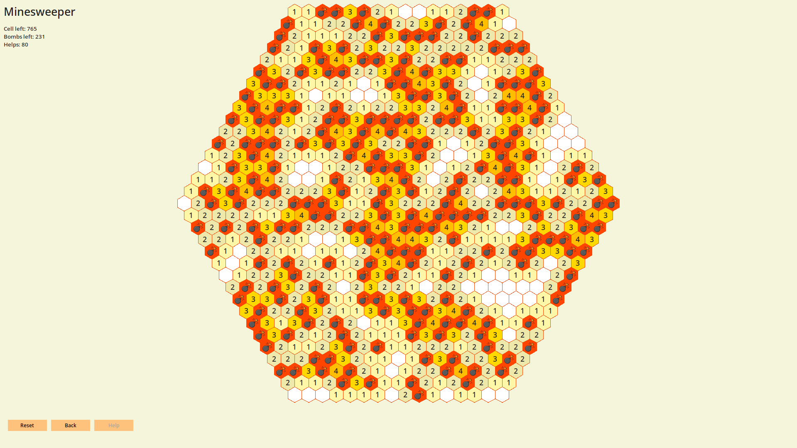

# Hexagonal MineSweeper
##### _Классическая игра в сапера на сетке из шестиугольных клеток с использованием графического интерфейса Tkinter_.
[Постановка задачи](https://github.com/OzerovaDaria/py_project/issues/2) 
### Правила игры

Цель игры состоит в том, чтобы вскрыть все клетки поля, которые не содержат мин, не будучи "взорванными".
Пример поля игры:



Щелчок по клетке покажет, что скрыто под ней. Если рядом с клеткой нет бомб (помеченных как клетка без номера при вскрытии), все соседние с ней плитки также будут автоматически вскрыты. Остальные клетки содержат числа (от 1 до 6), причем каждое число представляет собой количество мин, расположенных рядом с открытой клеткой.
Игра считается выигранной, как только игрок откроет все пустые или пронумерованные клетки, и все мины будут помечены флагом.

### Меню
Основное меню содержит опции:
- Новая игра (New game)
- Настройки (Settings)
- Выход (Quit)
    
В меню Настройки (Settings) можно выбрать цветовую тему игры:
- светлая (light)
- темная (dark)

А также есть возможность выбора языка:
- Английский/English
- Русский/Russian

После выбора настроек необходимо их сохранить!
    
В меню Новая Игра (New Game) можно выбрать размер поля игры:
tiny/small/meduim/big/large/giant.

Также есть возможность выбора уровня сложности игры, которая определется процентным соотношением числа бомб на игровом поле:
easy/medium/hard/extra hard.

Далее игра начинается!

### Сборка
- Для запуска тестов: `doit test`
- Для создания sphinx документации: `doit html`

### Запуск
Требования: Python version > 3.9

Запуск игры:
```sh
python3 -m minesweeper
```
